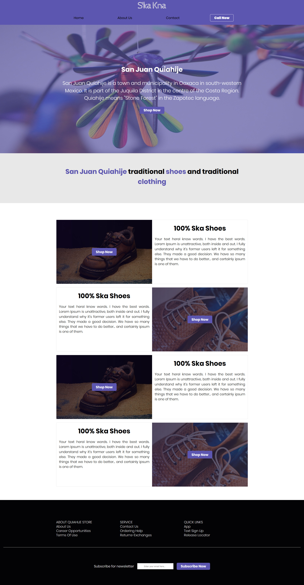
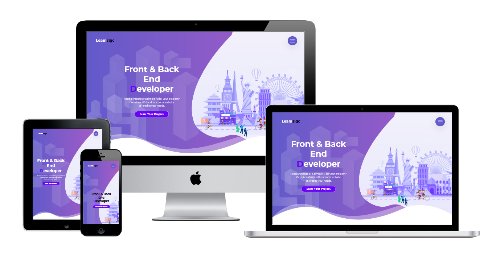

# Sk'a kn'a Concept

This a concept for a future online store for a chatino clothing line and natural shoes line from indigenous people from san juan quiahije oaxaca Mexico.

## Usage
[DEMO](https://leamsigc.github.io/skakna/)

Just open the 
```html 
index.html
```
 file on your favorite browser or use live server from vscode plugin.
## What learn whale working in this project:
    * About Intersection Observer for the animations 
    * How to use it to add classes or animation to a element when the element enter the screen.
    * How to use the Intersection Observer for lazy load Images for a better Speed and performance in the website.
## Code Example 
``` js
//Option for the Interception Observer 
let options = {
	rootMargin: '0px',
	threshold: 1.0
};

const addAnimation = target => {
	const interceptionObserver = new IntersectionObserver(entries => {
		entries.forEach(entry => {
			const box = entry.target;
			if (entry.intersectionRatio > 0.3) {
				box.classList.add('active');
				observer.disconnect();
			}
		});
	}, options);
	interceptionObserver.observe(target);
};

// Add the animation for each element in the array
elElementToAddIntersectionObserver.forEach(card => {
	addAnimation(card);
});
```
### Here is a couple screenshot of the website 


    Mobile View


## Check my portfolio 

[](https://leamsigc.com)

## Fallow Me
[Twitter](https://twitter.com/leamsigc) || [Facebook](https://www.facebook.com/leamsigc) || [codepen](https://codepen.io/leamsigc)  || [linkedin](https://www.linkedin.com/in/leamsigc/)  || [youtube](https://www.youtube.com/user/leamsigc)